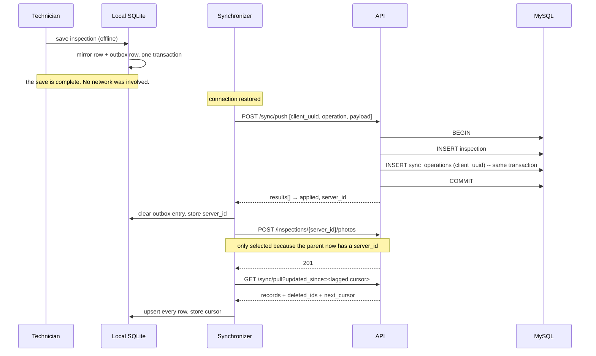

# Field Ops — Offline-First Sync

A reference implementation of offline-first data capture: a mobile client that writes to a local database and never blocks on the network, and an API that can be replayed, redelivered and retried without ever creating a duplicate.


---

## Overview

A technician walks into a building with no signal, records an inspection against a piece of equipment, takes three photos, and walks out. Two hours later the phone finds Wi-Fi. Everything that happened in between has to arrive at the server exactly once, in the right order, without the technician ever having thought about it.

That sentence is the whole problem, and it is harder than it sounds. This repository is a complete, tested implementation of it — an Expo/React Native client and a plain PHP 8 API — in a deliberately small domain: **sites**, **assets**, and **inspections** recorded against them.

It is a reference implementation, not a product. What it does not do is listed, in full, in [Not implemented](#not-implemented).

## Problem

"Offline support" is usually retro-fitted as a cache, and the retro-fit fails in specific ways:

- **The write path still assumes the network.** The save button calls the API, and the offline story is an error toast.
- **Retries duplicate.** The phone sends a record, the response is lost, the phone sends it again. The server has now created two inspections and has no way to know they are the same one.
- **The delta cursor silently loses rows.** "Give me everything changed since T" seems obvious until you notice that a row committed *during* the request that produced T has a timestamp before T and will never be sent again. This failure is invisible — no error, no warning, just a record that never arrives.
- **Media breaks ordering.** A photo belongs to an inspection that does not exist on the server yet.
- **The client cannot tell failures apart.** "No connection", "server unreachable", and "server said no" need three different behaviours; treating them alike either burns the retry budget on a request that will never succeed, or gives up on one that would have.

## Solution

Five mechanisms, each aimed at one of those failures.

**1 · The write path never touches the network.** Saving inserts into the local mirror and into an outbox table. That is the entire operation. Synchronisation is a separate, later, interruptible process.

**2 · The device mints the identity.** Every queued write carries a `client_uuid` generated from the platform CSPRNG *before* it leaves the phone. The server's `sync_operations` ledger has a `UNIQUE` index on it, and the ledger row is written **inside the same transaction as the domain row**. Replay a batch ten times and you get one inspection and ten identical responses — the first response body is stored and replayed verbatim. Two connections racing the same UUID resolve through the constraint: the loser catches SQLSTATE 23000 and reads back the winner's result.

**3 · The delta cursor is sampled early and lagged deliberately.** The cursor comes from the *database* clock, read before any query runs, and is then moved backwards by a configured overlap. That guarantees the window can only ever be too wide, never too narrow. The overlap is affordable because every pulled row is applied as an upsert, so a duplicate delivery costs nothing. A cursor that is somehow ahead of the server clock triggers a full reload instead of an empty delta forever.

**4 · Photos are gated on the parent.** The upload phase runs only after the push phase, and its query joins the parent inspection on `server_id`. A photo whose inspection has not been confirmed is not attempted — not skipped with an error, simply not selected.

**5 · Failures are classified once.** A single pure module decides between `offline`, `unreachable`, `refused`, `server_error`, `invalid_response` and `session_expired`. A refusal is terminal and parks the item with the server's reason attached. A transport failure costs no retry attempt. A server error costs one and retries with backoff.

## Key features

**Client**
- Local SQLite mirror plus an outbox, both written in one transaction on save.
- Exponential backoff, 1 → 16 minutes over six attempts, with **two distinct terminal states** — `rejected` (the server refused; retrying is pointless) and `failed` (the budget ran out; retrying is the user's call).
- Stuck-item recovery: rows left mid-flight by a crash return to pending at launch, without consuming an attempt.
- Three sync triggers — sign-in, connection restored, manual. No polling timer.
- A queue screen showing every pending item, its state, attempt count, next retry time, and the server's own reason for a refusal; retry and discard per item.
- Session survives an offline launch: the cached profile renders immediately and the server confirms in the background.
- Pending count in every screen header.

**API**
- Bearer tokens with a sliding expiry capped by an absolute ceiling; only the SHA-256 hash is stored.
- Login throttling per (email, IP) with a constant-time dummy bcrypt verify, so a missing account and a wrong password cost the same.
- Keyset paging on `(updated_at, id)` with tie-group protection — a page never ends inside a group of rows sharing one millisecond, and a page that *is* one tie group overflows rather than splitting.
- Soft deletes surfaced to clients as tombstones.
- Six-stage upload validation against the file's actual bytes.
- A stable response envelope where `error` is a machine code the client branches on and `message` is for humans only.

## Architecture

```
┌─ Device ──────────────────────────────────────────────┐
│  Screens                                              │
│     │ save                                            │
│     ▼                                                 │
│  SQLite ──┬── mirror   (sites, assets, inspections)   │
│           └── outbox   (operations + photos)          │
│                    │                                  │
│  Synchronizer ─────┘   phase 1  push                  │
│       │                phase 2  photos (gated)        │
│       │                phase 3  pull  (delta)         │
└───────┼───────────────────────────────────────────────┘
        │  HTTPS, bearer, envelope
┌───────▼───────────────────────────────────────────────┐
│  index.php  front controller · route table            │
│      │                                                │
│  core/  auth · permissions · idempotency · uploads    │
│      │  request · response · errors · database        │
│      ▼                                                │
│  routes/  auth · sync · inspections                   │
│      │                                                │
│  MySQL 8  DATETIME(3) · ON UPDATE CURRENT_TIMESTAMP   │
│           sync_operations (UNIQUE client_uuid)        │
└───────────────────────────────────────────────────────┘
```

A write that happens offline:



Full design rationale — including the alternatives that were rejected and why — is in [`docs/architecture.md`](docs/architecture.md).

## Tech stack

**API** PHP 8.1+ (`strict_types` everywhere), MySQL 8, PDO with emulated prepares disabled, no framework, no Composer
**Client** React Native 0.81 / Expo SDK 54, JavaScript, React Navigation, expo-sqlite, expo-secure-store, expo-crypto, expo-image-picker, NetInfo
**Tests** A dependency-free PHP harness; `node:test` with `node:sqlite`

## Project structure

```
├── api/
│   ├── index.php              Front controller and route table
│   ├── config.php             The only place environment values are read
│   ├── core/
│   │   ├── database.php       PDO, the database clock, SQL↔ISO converters
│   │   ├── auth.php           Token issue/verify/revoke, login throttling
│   │   ├── permissions.php    Roles, grants, wildcard matching
│   │   ├── idempotency.php    Ledger + domain write in one transaction
│   │   ├── uploads.php        Six-stage content validation
│   │   ├── request.php        Typed, bounded field extraction
│   │   ├── response.php       The envelope
│   │   └── errors.php         Guarantees a JSON body, always
│   ├── routes/                auth · sync · inspections
│   ├── database/              schema.sql · seed_demo.sql
│   └── tests/                 Runner, harness, six case groups
├── mobile/
│   ├── App.js                 Composition root — installs the three seams
│   └── src/
│       ├── offline/           sqlite · db · queue · backoff · idempotency · synchronizer
│       ├── services/          config · failures · http · transport · api · authStorage
│       ├── context/           AuthContext · SyncContext
│       ├── screens/           Login · Sites · Assets · InspectionForm · SyncStatus
│       └── navigation/
│   └── tests/                 Four files, 54 cases
└── docs/architecture.md
```

## API

Base path `/api/v1`. Every response uses the same envelope.

```json
{ "ok": true,  "data": {}, "message": null, "meta": { "server_time": "2026-08-25T12:00:00.000Z" } }
{ "ok": false, "error": "invalid_cursor", "message": "…", "details": null }
```

| Method | Path | Auth | Purpose |
|---|---|---|---|
| `POST` | `/auth/login` | — | Returns a bearer token. Throttled per (email, IP); every failure path returns the same `invalid_credentials`. |
| `GET` | `/auth/me` | bearer | Profile, and slides the token's expiry. |
| `POST` | `/auth/logout` | bearer | Revokes only the token used for the request. |
| `GET` | `/sync/pull?updated_since=&limit=` | bearer | Delta or full load. Returns `records`, `deleted_ids` and `has_more` per entity, plus `next_cursor`. |
| `POST` | `/sync/push` | bearer | A batch of operations, each with a `client_uuid`. Returns `results[]` with `applied` / `duplicate` / `rejected` per operation. |
| `POST` | `/inspections/{id}/photos` | bearer | `multipart/form-data`. `201` on store, `200` on replay. |

**Push operations**

| Operation | Permission | Payload |
|---|---|---|
| `inspection.create` | `inspections.write` | `asset_id`, `checklist_result`, `reading_value?`, `reading_unit?`, `notes?`, `performed_at?` |
| `inspection.update` | `inspections.write` | `inspection_client_uuid`, plus the fields to change. Rejects with `conflict` when the inspection has been reviewed. |
| `asset.set_status` | `assets.write` | `asset_id`, `status` |

**Roles** — `technician` (`sync.pull`, `inspections.write`, `inspections.photo`), `supervisor` (adds `inspections.*` and `assets.write`), `admin` (`*`). Matching supports exact slugs, prefix wildcards and a global wildcard.

## Database

Eight server tables. The three that carry the design:

| Table | Why it looks the way it does |
|---|---|
| `inspections` | `client_uuid` is `UNIQUE` — the device's identity is the record's identity. `performed_at` and `created_at` are separate, because when the work happened and when the server heard about it are different facts. Indexed on `(updated_at, id)` for keyset paging. |
| `sync_operations` | The idempotency ledger. `UNIQUE (client_uuid)` plus the stored `result_json`, so a replay returns the original response rather than a new one. |
| `inspection_photos` | `client_uuid` unique, `sha256`, `byte_size`, dimensions, and a `stored_path` relative to an upload directory that the web server is denied. |

Every synchronised table uses `DATETIME(3)` with `ON UPDATE CURRENT_TIMESTAMP(3)`, so a row edited by tooling outside this API still reaches devices. Deletes are soft, and surface to clients as tombstones.

On the device: mirrors of `sites` and `assets` keyed on the server id; `inspections` keyed on `client_uuid` with `server_id` null until confirmed; the `outbox`; and a small `sync_state` key/value table holding the cursor.

## Security

- Bearer tokens stored as SHA-256 hashes, sliding expiry with an absolute ceiling, per-token revocation.
- Login throttling per (email, IP), with a dummy bcrypt verify so a missing account costs the same as a wrong password.
- Passwords hashed with bcrypt at cost 12.
- Prepared statements everywhere, emulated prepares disabled; `LIMIT` and `INTERVAL` bound as integers.
- Upload validation in six stages against real bytes: PHP error code, size read from the file itself, extension allow-list, `finfo` magic bytes, `getimagesize` type cross-check, and a positive-dimension check. Files are stored under a generated random name, outside the web root, in a directory the server denies.
- Every operation in a push batch is permission-checked individually, so one forbidden operation does not abort the batch.
- Error detail is echoed only when `APP_ENV=local`; otherwise it goes to the log.
- An idempotency replay from a *different* user is refused, not answered — the ledger is scoped to its owner.

## Tests

116 cases across two suites. Neither needs a device, a simulator or a running server; one optional group needs a database and says so when it cannot find one.

```bash
php api/tests/run.php     # 54 cases without a database, 62 with one
cd mobile && npm test     # 54 cases
```

| Suite | Covers |
|---|---|
| cursor arithmetic | SQL↔ISO conversion, rejection of relative expressions, and the property that the overlap only ever moves a cursor backwards |
| delta cursor decision | empty → full load, valid → delta, unparseable → 422, ahead of the clock → self-heal |
| permissions | four roles × five slugs, prefix and global wildcards, unknown roles, empty inputs |
| upload validation | real bytes — a genuine PNG, a PNG named `.jpg`, a PHP script named `.jpg`, a signature with a payload behind it, a 0x0 header, size boundaries, and four PHP upload error codes |
| idempotency ledger | replays create nothing, ten replays leave one row, another user's replay is refused, a rejected write leaves no ledger row, and a real two-connection SQLSTATE 23000 collision |
| delta paging | the cursor is exclusive, a page never splits a tie group, paging to exhaustion delivers everything, tombstones appear in deltas and not in full loads |
| MySQL integration | the schema executes, `ON UPDATE` fires on its own, integer-bound `LIMIT`/`INTERVAL`, and the sliding expiry never passing the ceiling |
| backoff · failures · idempotency · outbox · syncCycle (JS) | the retry schedule, every branch of the failure classifier, 50,000 generated UUIDs with no collision, the full outbox state machine, and the three-phase cycle including the photo gate and an interrupted full load leaving the mirror intact |

**The tests found three real defects**, all fixed and all recorded in [`NOTES.md`](NOTES.md):

1. The pager trimmed the final timestamp group from *every* truncated page, not only one straddling the boundary — a page of four returned three rows.
2. A hand-built PNG header declaring a 0×0 image passed every content check.
3. **A claim in this repository's own documentation was false.** It asserted that `finfo` is fooled by an eight-byte magic header and `getimagesize` catches it. Measured on PHP 8.4 it is the other way round. The comment and the architecture document were corrected to match what a test observed rather than what seemed plausible.

## Installation

```bash
git clone https://github.com/carlitod199/field-ops-offline-sync.git
cd field-ops-offline-sync

mysql -u root -p -e "CREATE DATABASE field_ops CHARACTER SET utf8mb4"
mysql -u root -p field_ops < api/database/schema.sql
mysql -u root -p field_ops < api/database/seed_demo.sql

cp .env.example .env     # then set DB_* and APP_ENV=local
```

## Environment variables

`.env.example` contains placeholders only. The relevant ones:

| Variable | Purpose |
|---|---|
| `APP_ENV` | `local` echoes error detail in responses; anything else logs it instead. |
| `DB_HOST` `DB_NAME` `DB_USER` `DB_PASS` | Database connection. |
| `TOKEN_IDLE_MINUTES` `TOKEN_ABSOLUTE_DAYS` | Sliding expiry and its ceiling. |
| `LOGIN_MAX_ATTEMPTS` `LOGIN_WINDOW_MINUTES` | Login throttle. |
| `SYNC_PAGE_LIMIT` `SYNC_MAX_BATCH` | Pull page size and push batch cap. |
| `SYNC_CURSOR_OVERLAP_SECONDS` | How far the delta cursor is lagged. |
| `UPLOAD_DIR` `UPLOAD_MAX_BYTES` | Photo storage, denied to the web server. |
| `CORS_ALLOWED_ORIGINS` | Allow-list. |

## Running locally

```bash
php -S 127.0.0.1:8000 api/index.php     # API

cd mobile && npm install && npx expo start
```

Demo accounts are at the top of `api/database/seed_demo.sql`. On a physical handset `localhost` is the handset, so point the app at the LAN address:

```bash
EXPO_PUBLIC_API_URL=http://192.168.0.10:8000/api/v1 npx expo start
```

## Technical decisions

**The client generates the identity, not the server.** This is the decision everything else follows from. If the server assigns the id, the device cannot name a record it has not successfully sent, so it cannot ask "did this arrive?" without ambiguity — and a lost response becomes indistinguishable from a lost request. A client-generated UUID makes replay detection a `UNIQUE` index rather than a heuristic.

**The ledger row and the domain row share one transaction.** Writing the ledger afterwards leaves a window where the domain row exists and the ledger does not, so a retry in that window duplicates. This is the single most important line in the idempotency module and it is the one a reviewer should check first.

**The delta cursor is lagged, and the client upserts.** A cursor sampled at the client's clock, or after the read, or without overlap, all lose rows in ways that never raise an error. Lagging the cursor makes the window too wide, and idempotent apply makes "too wide" free. Trading a small amount of redundant traffic for a correctness guarantee is the right side of that trade.

**Tie-group protection in the pager.** Ordering on `(updated_at, id)` is not enough on its own: if a page boundary lands inside a group of rows sharing one millisecond, advancing the cursor past that timestamp skips the rest of the group. The pager probes one row beyond the page and trims back to a clean boundary — and when the whole page *is* one tie group, it overflows rather than splitting.

**Refused and failed are different states.** Collapsing them into "error" means a permanently-invalid record retries six times, and a transient failure looks permanent. `rejected` carries the server's own machine-readable reason to the queue screen; `failed` means the budget ran out and offers a retry.

**Composition root for the three native seams.** The SQLite driver, the UUID generator and the network transport are installed once in `App.js`. That is why `src/offline/` has no device dependency, and why the entire push → photos → pull cycle runs in Node against a real SQLite database in the test suite. Testability here was a design constraint, not an afterthought.

**No framework, no Composer, no ORM.** The target deployment is ordinary PHP hosting. The cost is that routing, validation, migrations and dependency management are hand-written or absent, and the absence is visible below.

## Not implemented

Stated in full, because a reference implementation that pretends to be complete is worse than one that does not.

- **No UI tests, and the app has never been run.** The offline layer, the classifier and the API's logic are covered. No screen, context or navigator is rendered by a test, and there has been no `npm install`, no Metro bundle and no device. Ordinary runtime faults remain possible.
- **Verified against MariaDB 10.11, not MySQL 8.** The schema targets MySQL 8; one difference already surfaced (MariaDB accepts a string-bound `LIMIT`, MySQL 8 does not).
- **No review workflow.** `inspections.status` can be `reviewed` and the conflict policy depends on it, but nothing here *sets* it. The state exists so the conflict path is reachable; the tool that produces it does not.
- **No edit screen.** The server supports `inspection.update`; the app never enqueues it.
- **No photo retrieval.** Photos upload; nothing serves them back. A real deployment needs an authenticated download route.
- **Uploads accept a valid image with appended data** — asserted in the suite rather than hidden. Harmless as deployed, but a real limit of content sniffing.
- **No migrations.** `schema.sql` creates from scratch. There is no upgrade path.
- **No refresh tokens**, no rate limiting beyond login, no multi-tenancy, no conflict-resolution UI, no background sync, no photo compression, no structured logging or tracing, and no retention job for `login_attempts`.
- **No `eas.json`.** Build profiles and store credentials are deployment concerns and do not belong in a public repository.

## License

MIT — see [LICENSE](LICENSE).
